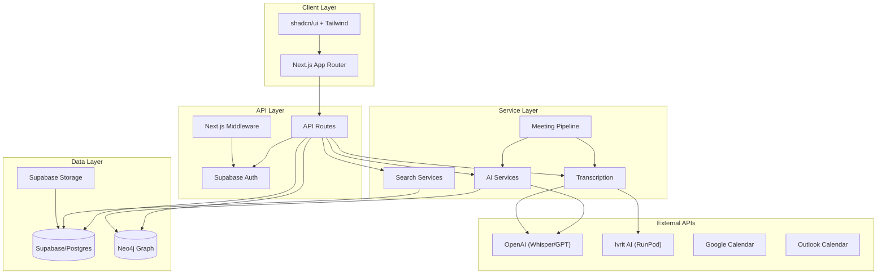
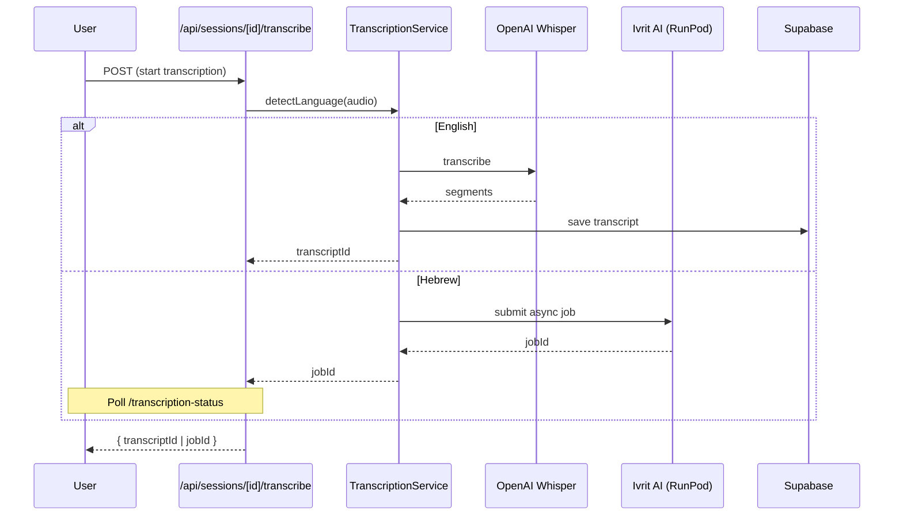
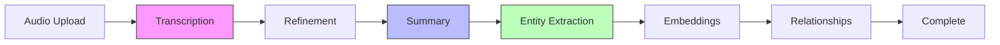
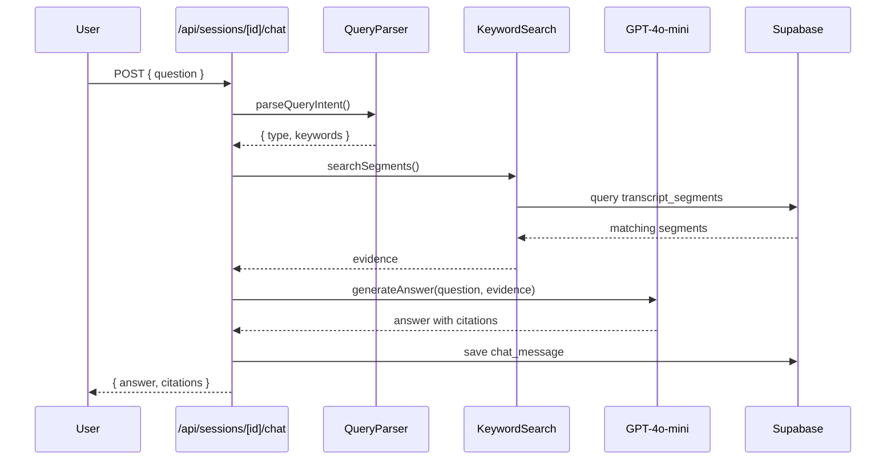

# Codebase Map

> Auto-generated by Cartographer. Last mapped: 2026-01-14

## System Overview



## Directory Structure

```
tami-2/
├── src/
│   ├── app/                    # Next.js App Router
│   │   ├── (auth)/             # Auth pages (login, signup, reset)
│   │   ├── (dashboard)/        # Protected dashboard routes
│   │   │   ├── meetings/       # Meeting list and detail pages
│   │   │   ├── entities/       # Knowledge graph page
│   │   │   ├── memory/         # Global search chat
│   │   │   └── ...
│   │   ├── api/                # API routes
│   │   │   ├── sessions/       # Meeting CRUD + processing
│   │   │   ├── graph/          # Neo4j entity operations
│   │   │   ├── memory/         # Global chat API
│   │   │   ├── search/         # Keyword + semantic search
│   │   │   ├── integrations/   # Google/Outlook OAuth
│   │   │   └── ...
│   │   └── auth/callback/      # OAuth callback handler
│   ├── components/             # React components
│   │   ├── ui/                 # shadcn/ui primitives
│   │   ├── meetings/           # Meeting-specific components
│   │   ├── meetings-v2/        # Refactored meeting components
│   │   ├── entities/           # Entity management modals
│   │   ├── recording/          # Audio recording UI
│   │   └── ...                 # Page components
│   ├── lib/                    # Core libraries
│   │   ├── ai/                 # OpenAI integrations
│   │   ├── transcription/      # Whisper + Ivrit AI
│   │   ├── pipelines/          # Meeting ingestion pipeline
│   │   ├── parsers/            # VTT/SRT/text parsers
│   │   ├── supabase/           # Supabase clients
│   │   ├── neo4j/              # Neo4j graph client
│   │   └── ...
│   ├── hooks/                  # React hooks
│   ├── features/               # Feature modules
│   │   └── meeting-bots/       # Bot integration (isolated)
│   ├── stores/                 # Zustand stores
│   ├── contexts/               # React contexts
│   └── i18n/                   # Internationalization
├── messages/                   # i18n translations (he, en)
├── supabase/migrations/        # Database schema
├── e2e/                        # Playwright E2E tests
├── scripts/                    # Utility scripts
│   └── neo4j/                  # Python Neo4j tools
└── docs/                       # Documentation
```

## Module Guide

### App Pages (`src/app/`)

| File | Purpose | Key Features |
|------|---------|--------------|
| `page.tsx` | Landing page | Redirects authenticated users to /meetings |
| `layout.tsx` | Root layout | i18n, fonts, RTL direction, Toaster |
| `(auth)/login/` | Login wrapper | Delegates to LoginPage component |
| `(auth)/signup/` | Registration | Email/password + Google OAuth |
| `(dashboard)/layout.tsx` | Dashboard wrapper | React Query, AppShell, keyboard shortcuts |
| `(dashboard)/meetings/` | Meeting list/detail | Reuses MeetingsPage with optional initialMeetingId |
| `(dashboard)/entities/` | Knowledge graph | Force-directed graph visualization |
| `(dashboard)/memory/` | Global search | Multi-threaded chat across all meetings |

### API Routes (`src/app/api/`)

#### Sessions API
| Route | Methods | Purpose |
|-------|---------|---------|
| `/sessions` | GET, POST | List/create sessions |
| `/sessions/[id]` | GET, PATCH, DELETE | Session CRUD |
| `/sessions/[id]/transcribe` | POST | Start transcription (Whisper/Ivrit) |
| `/sessions/[id]/transcription-status` | GET | Poll async job status |
| `/sessions/[id]/chat` | GET, POST | Meeting Q&A with citations |
| `/sessions/[id]/summarize` | POST, PATCH | Generate/update AI summary |
| `/sessions/[id]/action-items` | GET, POST | Manage action items |
| `/sessions/[id]/speakers` | GET, POST, PATCH | Speaker management |
| `/sessions/[id]/entities` | GET | Extract named entities |
| `/sessions/[id]/export` | GET | Export to PDF/DOCX |
| `/sessions/import` | POST | Import external transcripts |

#### Knowledge Graph API
| Route | Methods | Purpose |
|-------|---------|---------|
| `/graph/entities` | GET, POST | List/create entities (Neo4j) |
| `/graph/entities/[id]` | GET, PATCH, DELETE | Entity CRUD |
| `/graph/entities/[id]/merge` | POST | Merge duplicate entities |
| `/graph/entities/[id]/similar` | GET | Find similar entities |
| `/graph/entities/duplicates` | GET | List potential duplicates |
| `/graph/relationships` | GET, POST | Entity relationships |
| `/graph/suggestions` | GET | Relationship suggestions |
| `/graph/visualize` | GET | Graph data for visualization |

#### Memory API
| Route | Methods | Purpose |
|-------|---------|---------|
| `/memory/chat` | GET, POST, DELETE | Global Q&A across meetings |
| `/memory/threads` | GET, POST | Chat thread management |

#### Search API
| Route | Methods | Purpose |
|-------|---------|---------|
| `/search` | GET | Keyword search |
| `/search/semantic` | GET | Vector similarity search |

### Components (`src/components/`)

#### Page Components
| Component | Purpose | Key Patterns |
|-----------|---------|--------------|
| `meetings-page.tsx` | Main meeting UI | React Query, URL query params, polling |
| `entities-page.tsx` | Knowledge graph | Canvas-based force simulation |
| `memory-page.tsx` | Global search | Thread-based chat, evidence citations |
| `new-meeting-page.tsx` | Create meeting | Multi-mode: upload, record, import |
| `login-page.tsx` | Landing + login | Marketing copy, OAuth |
| `app-shell.tsx` | Navigation shell | Responsive sidebar, active route |

#### Meeting Components (`meetings/`, `meetings-v2/`)
| Component | Purpose |
|-----------|---------|
| `ai-insights-panel.tsx` | Summary, decisions, tasks, speakers tabs |
| `audio-player.tsx` | Playback with speed control, seeking |
| `transcript-panel.tsx` | Searchable transcript with speaker editing |
| `meeting-chat.tsx` | Session Q&A with evidence |
| `documents-panel.tsx` | Attachment management |

#### UI Components (`ui/`)
Built on shadcn/ui + Radix primitives: Button, Card, Dialog, Tabs, Select, etc.

### Core Libraries (`src/lib/`)

#### AI Services (`ai/`)
| Module | Purpose | Key Features |
|--------|---------|--------------|
| `chat.ts` | RAG-based Q&A | Multi-session support, person filtering |
| `summarize.ts` | Meeting summaries | Timestamps, action items, decisions |
| `entities.ts` | Entity extraction | GPT function calling, 8 entity types |
| `relationships.ts` | Relationship extraction | Whitelisted types (injection safe) |
| `embeddings.ts` | Vector generation | OpenAI text-embedding-3-small |
| `entity-similarity.ts` | Duplicate detection | 4-phase cascade (alias → fuzzy → semantic → LLM) |
| `evidence-answer.ts` | Citation generation | JSON schema enforcement |
| `query-parser.ts` | Intent detection | Person-filter vs semantic routing |

#### Transcription (`transcription/`)
| Module | Purpose | Key Features |
|--------|---------|--------------|
| `service.ts` | Transcription orchestrator | Auto language detection, routing |
| `whisper.ts` | English ASR | OpenAI Whisper API |
| `ivrit.ts` | Hebrew ASR | RunPod serverless, async jobs |
| `refinement.ts` | Transcript cleanup | Conservative + deep modes |
| `segments.ts` | Segment utilities | Deduplication, speaker normalization |

#### Pipelines (`pipelines/meeting-ingestion/`)
| Module | Purpose |
|--------|---------|
| `index.ts` | Pipeline orchestrator |
| `steps/transcribe.ts` | ASR step |
| `steps/summarize.ts` | Summary generation |
| `steps/extract-entities.ts` | NER extraction |
| `steps/extract-relationships.ts` | Relationship extraction |
| `steps/generate-embeddings.ts` | Vector embedding |

#### Database Clients
| Module | Purpose |
|--------|---------|
| `supabase/client.ts` | Browser Supabase client |
| `supabase/server.ts` | Server Supabase client |
| `supabase/middleware.ts` | Auth session refresh |
| `neo4j/client.ts` | Neo4j driver singleton |

### Hooks (`src/hooks/`)
| Hook | Purpose |
|------|---------|
| `use-session.ts` | Session fetching with polling |
| `use-session-query.ts` | React Query wrappers |
| `use-recording.ts` | MediaRecorder with chunked upload |
| `use-waveform.ts` | Audio visualization |
| `use-toast.ts` | Toast notifications |

### Features (`src/features/`)

#### Meeting Bots (`meeting-bots/`)
Isolated module for calendar integration and bot joining (placeholder adapters).

| Module | Purpose |
|--------|---------|
| `oauth/google.ts`, `outlook.ts` | OAuth flows |
| `bots/*.ts` | Platform adapters (Zoom, Meet, Teams) |
| `selection/filters.ts` | Rule-based meeting filtering |
| `storage/inMemoryStore.ts` | Temporary event storage |

## Data Flow

### Transcription Flow


### Meeting Ingestion Pipeline


### Q&A Flow (RAG)


## Conventions

### Naming
- **Files**: kebab-case (`meeting-chat.tsx`)
- **Components**: PascalCase (`MeetingChat`)
- **Hooks**: camelCase with `use` prefix (`useSession`)
- **API routes**: REST-style paths (`/api/sessions/[id]/chat`)

### Component Patterns
- Server Components by default
- `"use client"` for interactive components
- `cn()` for Tailwind class merging
- `@/` path alias maps to `./src/`

### i18n
- Default locale: Hebrew (`he`)
- Cookie-based locale storage
- `useTranslations()` for client components
- `getTranslations()` for server components
- RTL utilities: `.ms-auto`, `.me-auto`, `.start-0`, `.end-0`

### Authentication
- RLS enforced on all tables
- `auth.uid()` for user filtering
- OAuth: Google, Email/Password
- Session refresh in middleware

### API Responses
- Success: `{ data: T }` or `{ success: true, ... }`
- Error: `{ error: string }` with HTTP status
- Pagination: `{ data: T[], total, limit, offset }`

## Gotchas

### Architecture
1. **Dual Database**: Postgres (Supabase) for relational, Neo4j for knowledge graph
2. **Async vs Sync Transcription**: Hebrew uses RunPod async jobs, English is synchronous
3. **Language Default**: Always defaults to Hebrew if detection fails
4. **Segment Deduplication**: Deduplicated by time+text before display

### AI Services
5. **RAG Person Filtering**: CRITICAL guardrails prevent semantic fallback for person queries
6. **Entity Similarity Cascade**: Alias → Fuzzy → Semantic → LLM (cost-controlled)
7. **Relationship Whitelist**: Prevents Cypher injection
8. **Summary Hallucination**: Aggressive detection for warmup speech patterns

### Client
9. **Global Function Injection**: `window.meetingAudioSeekTo` for cross-component communication
10. **URL Query State**: Highlighted segments via `?seg=`, `?t=`, `?doc=`
11. **Mixed i18n**: Legacy `useLanguage()` vs modern `next-intl`
12. **Toast Limit**: Only 1 toast visible at once

### Recording
13. **System Audio**: Requires user to check "Share audio" in screen picker
14. **Chunked Upload**: Retries with exponential backoff, falls back to full blob
15. **Duration Warnings**: 1hr soft, 1.5hr strong, 2hr max

### Database
16. **Auto-Tagging**: Summary topics create tags with `source: "auto:topic"`
17. **Soft Delete**: Segments use `is_deleted` flag
18. **Unique Constraint**: One OAuth connection per provider per user

## Navigation Guide

**To add a new API endpoint:**
1. Create route file in `src/app/api/[resource]/route.ts`
2. Import Supabase server client
3. Check auth with `supabase.auth.getUser()`
4. Use RLS-enabled queries

**To add a new page:**
1. Create page in `src/app/(dashboard)/[name]/page.tsx`
2. Wrap in dashboard layout (automatic)
3. Add translations to `messages/en.json` and `messages/he.json`
4. Add navigation item in `app-shell.tsx`

**To add a new AI feature:**
1. Create module in `src/lib/ai/`
2. Use lazy-initialized `getOpenAI()` singleton
3. Support both Hebrew and English prompts
4. Add to pipeline if needed

**To modify transcription:**
1. Update provider in `src/lib/transcription/`
2. Adjust language routing in `service.ts`
3. Test with both Whisper and Ivrit AI

**To add entity type:**
1. Update `EntityType` in `src/lib/neo4j/types.ts`
2. Add to extraction prompt in `src/lib/ai/entities.ts`
3. Update UI in `entities-page.tsx`
4. Add icon mapping
