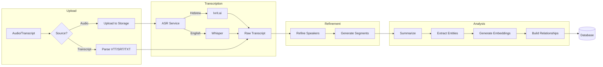
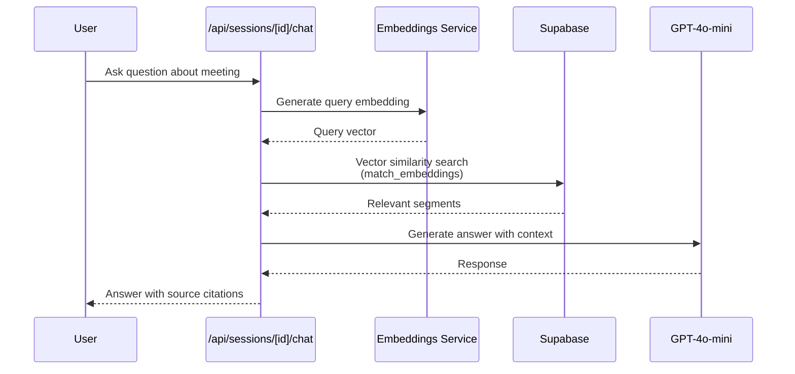
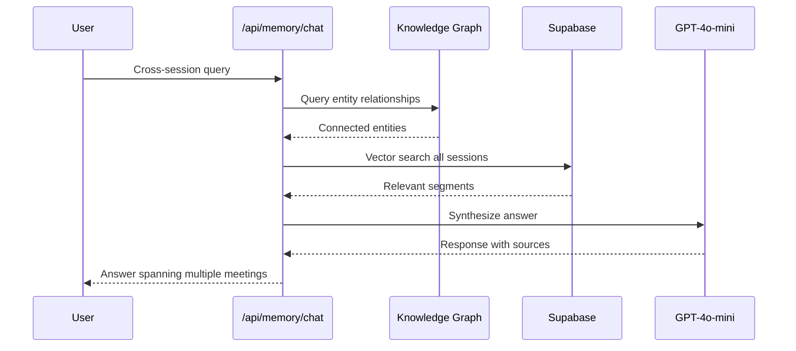
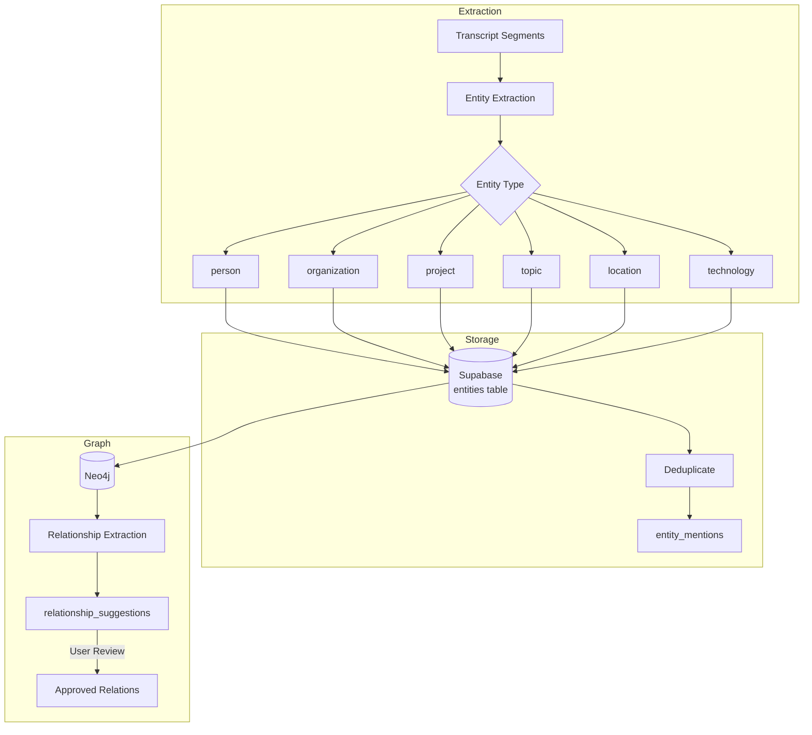
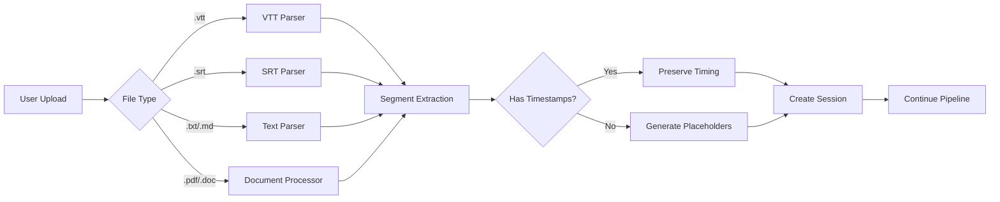
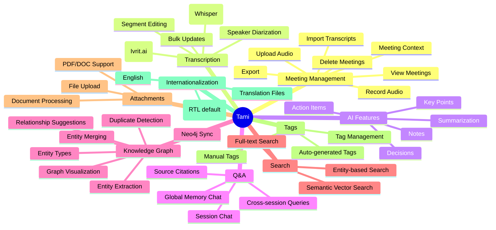

# Tami Codebase Architecture Map

A comprehensive guide to the Tami meeting intelligence platform codebase, with Mermaid diagrams and file path references.

---

## Table of Contents
1. [Directory Structure](#directory-structure)
2. [Core Flows](#core-flows)
3. [Data Model](#data-model)
4. [AI Services Layer](#ai-services-layer)
5. [API Surface](#api-surface)
6. [Frontend Architecture](#frontend-architecture)
7. [Feature Landscape](#feature-landscape)

---

## Directory Structure

```
tami-2/
├── src/
│   ├── app/                    # Next.js App Router
│   │   ├── (auth)/            # Auth pages (login, signup, reset)
│   │   ├── (dashboard)/       # Main app pages
│   │   │   ├── meetings/      # Meeting list & detail views
│   │   │   ├── memory/        # Global memory chat
│   │   │   ├── entities/      # Entity browser
│   │   │   ├── search/        # Search page
│   │   │   ├── settings/      # User settings
│   │   │   └── profile/       # User profile
│   │   ├── api/               # API routes (40+ endpoints)
│   │   └── auth/callback/     # OAuth callback
│   │
│   ├── components/            # React components
│   │   ├── ui/               # shadcn/ui primitives
│   │   ├── meetings-v2/      # Meeting view components
│   │   ├── recording/        # Audio recording
│   │   ├── entities/         # Entity management
│   │   └── graph/            # Knowledge graph viz
│   │
│   ├── lib/                   # Core business logic
│   │   ├── ai/               # AI services (chat, summarize, entities)
│   │   ├── transcription/    # ASR services (Whisper, Ivrit)
│   │   ├── supabase/         # Database clients
│   │   ├── neo4j/            # Knowledge graph
│   │   ├── pipelines/        # Meeting ingestion pipeline
│   │   ├── parsers/          # Transcript parsers (VTT, SRT)
│   │   └── types/            # TypeScript types
│   │
│   ├── hooks/                 # React custom hooks
│   ├── stores/                # Zustand stores
│   └── features/              # Feature modules
│       └── meeting-bots/     # Bot integrations (Zoom, Meet, Teams)
│
├── supabase/
│   └── migrations/           # Database schema SQL
│
├── e2e/                       # Playwright E2E tests
├── messages/                  # i18n translations (he, en)
└── documentation/            # Project documentation
```

---

## Core Flows

### Flow 1: Meeting Lifecycle



**File Mappings:**
| Step | File Path |
|------|-----------|
| Upload | `src/app/api/sessions/route.ts` |
| Parse | `src/lib/parsers/vtt-parser.ts`, `srt-parser.ts`, `text-parser.ts` |
| ASR | `src/lib/transcription/service.ts` |
| Ivrit.ai | `src/lib/transcription/ivrit.ts` |
| Whisper | `src/lib/transcription/whisper.ts` |
| Refinement | `src/lib/transcription/refinement.ts` |
| Segments | `src/lib/transcription/segments.ts` |
| Summarize | `src/lib/ai/summarize.ts` |
| Entities | `src/lib/ai/entities.ts` |
| Embeddings | `src/lib/ai/embeddings.ts` |
| Relationships | `src/lib/ai/relationships.ts` |

**Pipeline Orchestration:** `src/lib/pipelines/meeting-ingestion/index.ts`

---

### Flow 2: Session Q&A (RAG)



**File Mappings:**
| Component | File Path |
|-----------|-----------|
| Chat API | `src/app/api/sessions/[id]/chat/route.ts` |
| Chat Logic | `src/lib/ai/chat.ts` |
| Embeddings | `src/lib/ai/embeddings.ts` |
| Vector Search | Supabase `match_embeddings` function |

---

### Flow 3: Global Memory Chat



**File Mappings:**
| Component | File Path |
|-----------|-----------|
| Memory Chat API | `src/app/api/memory/chat/route.ts` |
| Neo4j Client | `src/lib/neo4j/client.ts` |
| Memory Page | `src/app/(dashboard)/memory/page.tsx` |

---

### Flow 4: Entity & Knowledge Graph



**File Mappings:**
| Component | File Path |
|-----------|-----------|
| Entity Extraction | `src/lib/ai/entities.ts` |
| Entity Similarity | `src/lib/ai/entity-similarity.ts` |
| Relationships | `src/lib/ai/relationships.ts` |
| Neo4j Types | `src/lib/neo4j/types.ts` |
| Graph API | `src/app/api/graph/entities/route.ts` |
| Duplicates API | `src/app/api/graph/entities/duplicates/route.ts` |
| Merge API | `src/app/api/graph/entities/[id]/merge/route.ts` |
| Graph Sync | `src/app/api/graph/sync/route.ts` |
| Visualize API | `src/app/api/graph/visualize/route.ts` |

---

### Flow 5: Transcript Import



**File Mappings:**
| Component | File Path |
|-----------|-----------|
| Import API | `src/app/api/sessions/import/route.ts` |
| VTT Parser | `src/lib/parsers/vtt-parser.ts` |
| SRT Parser | `src/lib/parsers/srt-parser.ts` |
| Text Parser | `src/lib/parsers/text-parser.ts` |
| Document Processor | `src/lib/ai/document-processor.ts` |
| Parser Types | `src/lib/parsers/types.ts` |

---

## Data Model

### Core Tables

| Table | Purpose | Key Fields |
|-------|---------|------------|
| `sessions` | Meeting records | id, user_id, title, status, audio_url, source_type |
| `transcripts` | Full transcriptions | id, session_id, language, origin, external_format |
| `transcript_segments` | Segment-level text | id, transcript_id, speaker_name, text, start_time, end_time |
| `summaries` | AI-generated summaries | id, session_id, overview, key_points, decisions, notes |
| `action_items` | Extracted tasks | id, summary_id, description, assignee, deadline, completed |
| `entities` | Named entities | id, user_id, type, value, normalized_value, mention_count |
| `entity_mentions` | Entity occurrences | id, entity_id, session_id, context |
| `tags` | Session tags | id, user_id, name, color, source |
| `session_tags` | Tag assignments | session_id, tag_id |
| `chat_messages` | Q&A history | id, session_id, role, content |
| `memory_embeddings` | Vector embeddings | id, user_id, session_id, chunk_text, embedding |
| `relationship_suggestions` | Entity relationships | source_entity_id, target_entity_id, relationship_type, status |

### Type Definitions

**File:** `src/lib/types/database.ts`

```typescript
type SessionStatus = "pending" | "recording" | "processing" | "refining" | "completed" | "failed" | "expired"
type Language = "he" | "en" | "auto"
type EntityType = "person" | "organization" | "project" | "topic" | "location" | "date" | "product" | "technology" | "other"
type SourceType = "recorded" | "imported" | "summary_only"
type TranscriptOrigin = "asr" | "imported"
type ExternalFormat = "vtt" | "srt" | "text" | "doc" | "pdf" | "md"
```

### Database Migrations

| Migration | Purpose |
|-----------|---------|
| `20250107_initial_schema.sql` | Core tables (sessions, transcripts, segments, summaries) |
| `20250107_add_memory_embeddings.sql` | Vector embeddings for semantic search |
| `20250107_add_attachments.sql` | File attachments support |
| `20250109_add_memory_chat_messages.sql` | Global memory chat history |
| `20250109_add_relationship_suggestions.sql` | Entity relationship tracking |
| `20250112_add_transcript_ingestion.sql` | Import from external formats |

---

## AI Services Layer

| Service | Model | File Path | Purpose |
|---------|-------|-----------|---------|
| Hebrew ASR | Ivrit.ai (RunPod) | `src/lib/transcription/ivrit.ts` | Hebrew speech recognition |
| English ASR | Whisper | `src/lib/transcription/whisper.ts` | English speech recognition |
| Refinement | GPT-4o | `src/lib/transcription/refinement.ts` | Speaker diarization cleanup |
| Summarization | GPT-4o-mini | `src/lib/ai/summarize.ts` | Meeting summaries |
| Q&A Chat | GPT-4o-mini | `src/lib/ai/chat.ts` | Session Q&A |
| Embeddings | text-embedding-3-small | `src/lib/ai/embeddings.ts` | Vector embeddings |
| Entity Extraction | GPT-4o-mini | `src/lib/ai/entities.ts` | Named entity recognition |
| Relationship Extraction | GPT-4o-mini | `src/lib/ai/relationships.ts` | Entity relationships |
| Document Processing | GPT-4o-mini | `src/lib/ai/document-processor.ts` | PDF/DOC parsing |

**Auto-Summary Trigger:** `src/lib/ai/auto-summary.ts`

---

## API Surface

### Sessions API

| Method | Endpoint | Handler | Purpose |
|--------|----------|---------|---------|
| GET | `/api/sessions` | `route.ts` | List user sessions |
| POST | `/api/sessions` | `route.ts` | Create new session |
| GET | `/api/sessions/[id]` | `[id]/route.ts` | Get session details |
| PATCH | `/api/sessions/[id]` | `[id]/route.ts` | Update session |
| DELETE | `/api/sessions/[id]` | `[id]/route.ts` | Delete session |
| POST | `/api/sessions/[id]/transcribe` | `transcribe/route.ts` | Start transcription |
| GET | `/api/sessions/[id]/transcription-status` | `transcription-status/route.ts` | Check transcription status |
| POST | `/api/sessions/[id]/refine` | `refine/route.ts` | Refine transcript |
| POST | `/api/sessions/[id]/summarize` | `summarize/route.ts` | Generate summary |
| POST | `/api/sessions/[id]/embeddings` | `embeddings/route.ts` | Generate embeddings |
| POST | `/api/sessions/[id]/chat` | `chat/route.ts` | Session Q&A |
| GET | `/api/sessions/[id]/speakers` | `speakers/route.ts` | Get speakers |
| PATCH | `/api/sessions/[id]/speakers` | `speakers/route.ts` | Update speakers |
| POST | `/api/sessions/[id]/reprocess` | `reprocess/route.ts` | Rerun pipeline |
| GET | `/api/sessions/[id]/export` | `export/route.ts` | Export session |
| GET | `/api/sessions/[id]/adjacent` | `adjacent/route.ts` | Get prev/next sessions |
| POST | `/api/sessions/import` | `import/route.ts` | Import transcript |

### Session Sub-resources

| Method | Endpoint | Handler | Purpose |
|--------|----------|---------|---------|
| GET/POST | `/api/sessions/[id]/tags` | `tags/route.ts` | Manage tags |
| GET/POST | `/api/sessions/[id]/action-items` | `action-items/route.ts` | Manage action items |
| PATCH/DELETE | `/api/sessions/[id]/action-items/[itemId]` | `[itemId]/route.ts` | Update/delete item |
| GET/POST | `/api/sessions/[id]/attachments` | `attachments/route.ts` | Manage attachments |
| DELETE | `/api/sessions/[id]/attachments/[id]` | `[attachmentId]/route.ts` | Delete attachment |
| GET/POST | `/api/sessions/[id]/entities` | `entities/route.ts` | Session entities |
| GET | `/api/sessions/[id]/relationships` | `relationships/route.ts` | Session relationships |
| PUT | `/api/sessions/[id]/segments/bulk` | `segments/bulk/route.ts` | Bulk update segments |

### Graph API

| Method | Endpoint | Handler | Purpose |
|--------|----------|---------|---------|
| GET | `/api/graph/entities` | `entities/route.ts` | List all entities |
| GET | `/api/graph/entities/[id]` | `[id]/route.ts` | Get entity |
| DELETE | `/api/graph/entities/[id]` | `[id]/route.ts` | Delete entity |
| GET | `/api/graph/entities/[id]/similar` | `similar/route.ts` | Find similar entities |
| POST | `/api/graph/entities/[id]/merge` | `merge/route.ts` | Merge entities |
| GET | `/api/graph/entities/duplicates` | `duplicates/route.ts` | Find duplicates |
| GET | `/api/graph/relationships` | `relationships/route.ts` | List relationships |
| GET | `/api/graph/suggestions` | `suggestions/route.ts` | Relationship suggestions |
| POST | `/api/graph/sync` | `sync/route.ts` | Sync to Neo4j |
| GET | `/api/graph/visualize` | `visualize/route.ts` | Graph visualization data |

### Other APIs

| Method | Endpoint | Handler | Purpose |
|--------|----------|---------|---------|
| POST | `/api/memory/chat` | `chat/route.ts` | Global memory chat |
| GET | `/api/search` | `route.ts` | Full-text search |
| GET | `/api/search/semantic` | `semantic/route.ts` | Semantic search |
| GET | `/api/entities` | `route.ts` | List entities |
| GET/POST | `/api/tags` | `route.ts` | Manage tags |
| DELETE | `/api/tags/[tagId]` | `[tagId]/route.ts` | Delete tag |
| DELETE | `/api/user/delete` | `delete/route.ts` | Delete user account |
| GET | `/auth/callback` | `route.ts` | OAuth callback |

---

## Frontend Architecture

### Page Structure

```
src/app/
├── page.tsx                          # Landing page
├── layout.tsx                        # Root layout
├── (auth)/
│   ├── login/page.tsx               # Login
│   ├── signup/page.tsx              # Sign up
│   ├── forgot-password/page.tsx     # Password reset request
│   └── reset-password/page.tsx      # Password reset
└── (dashboard)/
    ├── layout.tsx                   # Dashboard layout (sidebar, nav)
    ├── meetings/
    │   ├── page.tsx                # Meetings list
    │   ├── new/page.tsx            # New meeting upload
    │   └── [id]/page.tsx           # Meeting detail view
    ├── memory/page.tsx             # Global memory chat
    ├── entities/page.tsx           # Entity browser
    ├── search/page.tsx             # Search
    ├── settings/page.tsx           # Settings
    ├── profile/page.tsx            # Profile
    └── privacy/page.tsx            # Privacy policy
```

### Key Components

| Component | Path | Purpose |
|-----------|------|---------|
| **Meeting View (v2)** | | |
| TranscriptPanel | `components/meetings-v2/transcript-panel.tsx` | Transcript display with search |
| AIInsightsPanel | `components/meetings-v2/ai-insights-panel.tsx` | Summary, key points, actions |
| MeetingChat | `components/meetings-v2/meeting-chat.tsx` | Session Q&A interface |
| DocumentsPanel | `components/meetings-v2/documents-panel.tsx` | Attachments view |
| AudioPlayer | `components/meetings-v2/audio-player.tsx` | Audio playback controls |
| MeetingsSidebar | `components/meetings-v2/meetings-sidebar.tsx` | Meeting navigation |
| **Recording** | | |
| Recorder | `components/recording/recorder.tsx` | Audio recording |
| Waveform | `components/recording/waveform.tsx` | Audio visualization |
| ModeSelector | `components/recording/mode-selector.tsx` | Recording mode |
| **Entities** | | |
| AddEntityModal | `components/entities/add-entity-modal.tsx` | Create entity |
| DuplicateReviewModal | `components/entities/duplicate-review-modal.tsx` | Review duplicates |
| KnowledgeGraph | `components/graph/knowledge-graph.tsx` | Graph visualization |
| **Shared** | | |
| TranscriptViewer | `components/transcript-viewer.tsx` | Segment display |
| SummaryPanel | `components/summary-panel.tsx` | Summary display |
| ChatPanel | `components/chat-panel.tsx` | Chat interface |
| SpeakersPanel | `components/speakers-panel.tsx` | Speaker management |
| ActionItemsEditor | `components/action-items-editor.tsx` | Task management |
| LanguageToggle | `components/language-toggle.tsx` | Hebrew/English switch |

### Custom Hooks

| Hook | Path | Purpose |
|------|------|---------|
| `useSession` | `hooks/use-session.ts` | Session data & mutations |
| `useSessionQuery` | `hooks/use-session-query.ts` | React Query wrapper |
| `useRecording` | `hooks/use-recording.ts` | Audio recording state |
| `useWaveform` | `hooks/use-waveform.ts` | Waveform visualization |
| `useMediaQuery` | `hooks/use-media-query.ts` | Responsive breakpoints |

### UI Components (shadcn/ui)

Located in `src/components/ui/`:
- AlertDialog, Alert, Avatar, Badge, Button, Card
- Checkbox, Collapsible, Dialog, DropdownMenu
- Input, Label, Progress, ScrollArea, Select
- Separator, Sheet, Skeleton, Slider, Sonner, Tabs, Textarea

---

## Feature Landscape



---

## Infrastructure

### External Services

| Service | Purpose | Configuration |
|---------|---------|---------------|
| Supabase | Auth, PostgreSQL, Storage | `NEXT_PUBLIC_SUPABASE_URL`, `SUPABASE_ANON_KEY` |
| OpenAI | Whisper ASR, GPT models, Embeddings | `OPENAI_API_KEY` |
| RunPod | Ivrit.ai Hebrew ASR | `IVRIT_API_KEY`, `IVRIT_ENDPOINT_ID` |
| Neo4j | Knowledge graph | `NEO4J_URI`, `NEO4J_USER`, `NEO4J_PASSWORD` |
| Vercel | Deployment | `.vercel/` config |

### Key Files

| File | Purpose |
|------|---------|
| `src/middleware.ts` | Auth session refresh |
| `src/lib/supabase/client.ts` | Browser Supabase client |
| `src/lib/supabase/server.ts` | Server Supabase client |
| `src/lib/supabase/middleware.ts` | Middleware helpers |
| `messages/he.json` | Hebrew translations |
| `messages/en.json` | English translations |
| `playwright.config.ts` | E2E test configuration |
